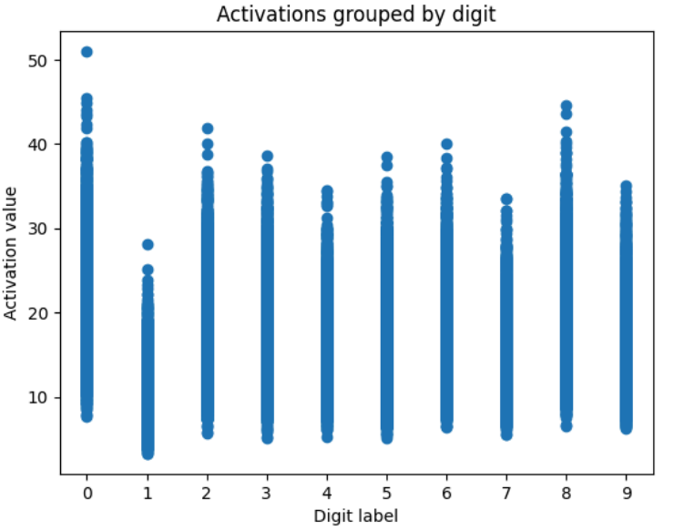
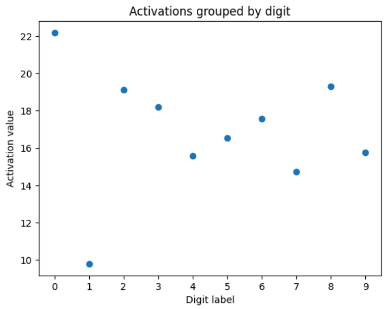
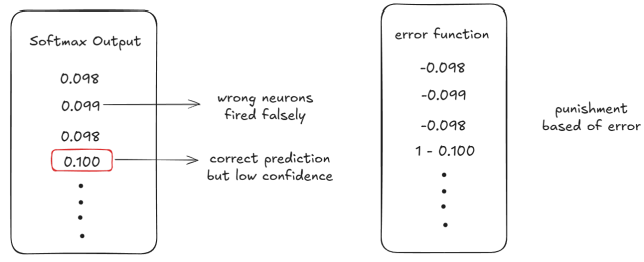
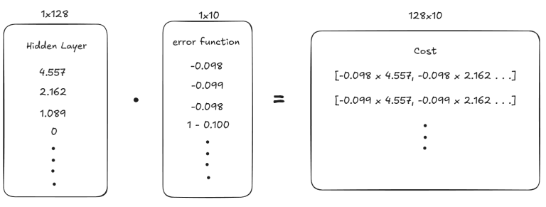

# Handwritten Digit Recognition

### Building Neural Network from Scratch

I wanted to build neural networks with just intuition and raw mathematics. To start off, I asked Claude to give me the simplest Neural Network project with a beginner hint.

It asked me to train a neural network on MNIST.

Initial Hint: Input Layer (784) -> Hidden Layer (128) -> Output Layer. Network of units arranged in layers, each unit takes input -> multiplies with weights -> sum -> applies activation function. Starts with random weights and adjusts them based on error.

---

### Input Layer

Rough idea: take input images, process them, extract features, but what are features? More importantly, what is an image?

So I switched to the easiest job first, that was to understand the input. Found MNIST dataset from [Hugging Face](https://huggingface.co/datasets/ylecun/mnist). I tried to dive deep into the dataset itself, and the images are 28x28 pixels. And a pixel is basically a number representing the level of grey from 0-255. Nothing more.

From the starter hint it was not hard to figure out that the input layer is just pixels stacked in an array. 28x28 - 784

---

### Hidden Layer

It contains 128 units. 784/128 is not an integer, so we are definitely not merging/stacking the inputs.

That leaves two options:

1. I find 128 features from the input layer, these can be trace of the input matrix, determinant, cofactors, sum of rows of pixels. But how is this useful if a feature produces the same value for all the numbers? And is this not just another input layer?
2. We assign random weights, 128 different matrices with 784 random weights, one for each pixel. These weights would determine how much that feature contributes. This forms our hidden layer.

Why 128? Less than 16, too few features to learn. More than a thousand, learns pixels not features.

The weights that form the hidden layer are also features like [1] but these are built to be optimized for identifying the difference between input.

---

### Output Layer

To move from hidden layer to the next output layer I actually had multiple ideas.

1. Always starting from the simplest thing that comes to my mind. Sum up the hidden layer, all 128 features into one single value then normalize it before producing the mean for each label. Then the mean your sum is closest to after normalization would be your output. This produced 22% accuracy almost random.

   

   

   This 22% accuracy was a given just with how mean works. But this raised serious problems later on. What will be the error? How will I know which weights to update? Do I drift all the weights in the same direction every time, will that not negate the effects of one another?
2. I could not decide on a function, since without running the entire pipeline how would I even know which function is better? And it clicked, there is no best function, we let the neural network dictate it.

Multiplying the hidden layer (128,) with 10 random weights each of length 128, signifying a digit. I let the network learn these functions from backpropagation.

Each of these 10 outputs would correspond to one digit in any order, since it is completely up to me how I infer these and would vary only with how I use them.

---

### Activation Function - Softmax

I have 10 outputs, each corresponds to a digit. But these are just random numbers both negative and positive. I need to use them to identify a label.

I had different definitions in my mind.

1. The simplest one again, we sum these output layer values. This brought a problem, I do not know what this number should be in order to output a value. If I run the training just to find these thresholds, how will I update the weights.
2. I pick the largest one. From the output layer, I pick the argument which was largest. But this posed the same problem as before, how will I update the weights, increase, decrease, and by how much.
3. The third way was to transform these 10 numbers on the same +ve number line. And then pick the largest one. Since they are all in same direction, the error would just be distance from origin. So we convert 10 different parameters/features -> 10 different numbers, these 10 numbers would depict the probability/confidence for each number. Deriving this function through trial and error.
   1. For x units in output layer we can calculate the output for each unit using the formula -> *x_i / sum(x)* This gives us the probability of x. But the problem that I missed was that sum(x) could be zero or positive.
   2. How to fix that? Just square all the units, all positive, no more zero sum. But the problem, there is no information whether the confidence was +ve or -ve when working with the error function. +5 and -5 would produce the same output.
   3. Then what if I raise a constant by the power of an output unit. The constant being 2 in my case. And it works. For negative values we have lower probability showing low confidence.

---

### Error and Cost Function

Before I start updating the weights, I must understand what direction I need to update them to, and by how much.

To answer these I have two different functions - Error, that calculates how off my predictions were, and Cost, that calculates how much the weights must be altered.

**Error(prediction, actual)** is easy to understand. For the correct label i, the error should be *1 - confidence of x_i*, since we want the confidence on the correct label to be 1. Similarly for incorrect labels the error should be *0 - confidence of x_j*

Or more simply: error = actual - prediction



These signs are really important, a negative error in my case denotes how much the weights must be punished. And positive error denotes how much they must be pumped.

**Cost** was the tricky part. In my initial implementation I was drifting all weights together based on error, but the network went into a loop of incorrect predictions. Where I understood that updating all the weights equally irrespective of how much they participated in the final error was brutal.

The first implementation of cost function:

```plaintext
Impact(n_i) = sum_j (n_i * w_{i,j})

Impact(n_i) = n_i * (sum_j w_{i,j})

E_total = sum_k E(k)

Cost(n_i) = [Impact(n_i) / sum_m Impact(n_m)] * E_total

n_i = activation/value of hidden neuron i
w_{i,j} = weight from hidden neuron i to output neuron j
Impact(n_i) = total contribution of n_i to the output layer
E(k) = error at output neuron k
E_total = total output error
Cost(n_i) = portion of total error attributed to hidden neuron i
```

Cost was effectively the impact of neuron times the error it was causing. With this definition I missed some clear details, the sum of error could be zero, the sum of weights can be zero. **Aggregation obscures information**

So I switched focus, Instead of calculating the impact of a neuron over the aggregated error, we focus on one error at a time.

```plaintext
Impact(n) = HiddenLayer * E(o)

Cost(w_i) = K * HiddenLayer * E(o)

w_i(new) = w_i + Cost(w_i)

n = hidden neuron(s)
HiddenLayer = hidden layer activations
w_i = weight i
E(o) = error at output o
K = scaling / learning constant
```



This cost comes with directional signal, can directly be summed up with the corresponding weight vector. This is the essence of gradients.

Implementing this I get an accuracy of ~60%. What we have built right now is a linear classifier with random features.

Then came the difficult part, how do I carry this loss over to the weights of Input Layer? There is no clear definition of error at the hidden layer. Can I apply chain rule over my error?

We need another definition for error at hidden layer.

```plaintext
Error_hidden(n_l) = n_l * sum_{i=0}^{k-1} (w_{l,i} * o(i))

Cost(I_r -> n_l) = I_r * Error_hidden(n_l) * K

I_r = r-th input neuron value
n_l = l-th hidden layer neuron activation
o(i) = i-th output neuron activation
w_{l,i} = weight from hidden neuron l to output neuron i
k = number of output neurons
Error_hidden(n_l) = error attributed to hidden neuron n_l
Cost(I_r -> n_l) = cost contribution from input I_r via hidden neuron n_l
K = scaling / learning constant
```

I was multiplying n_l in error function to ensure that weights for neurons that do not participate are not updated. But as I covered backpropagation later, it worked out because I was using ReLU as my activation function whose derivative somewhat matched my definition.

Implementing this, instantly jumped the accuracy to 95+%


Ashisane | Utkarsh Tyagi
